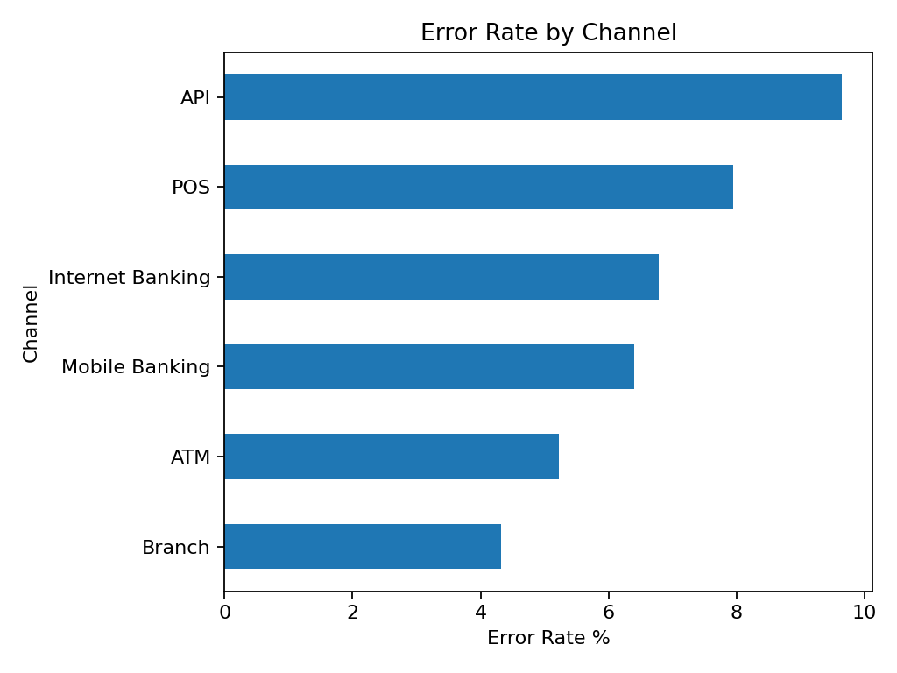
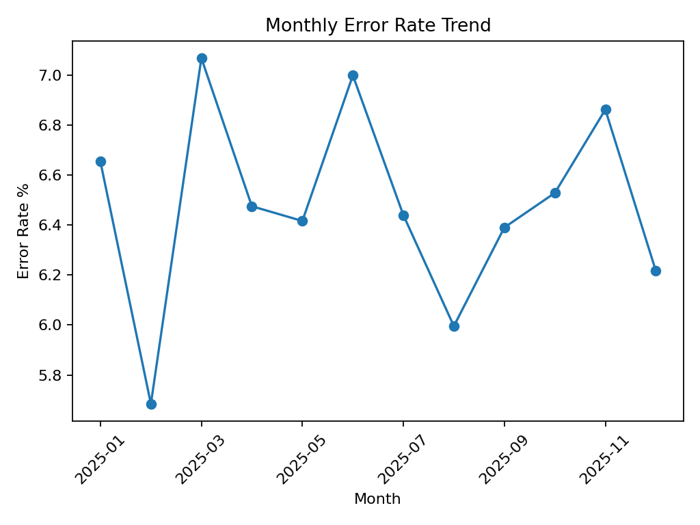
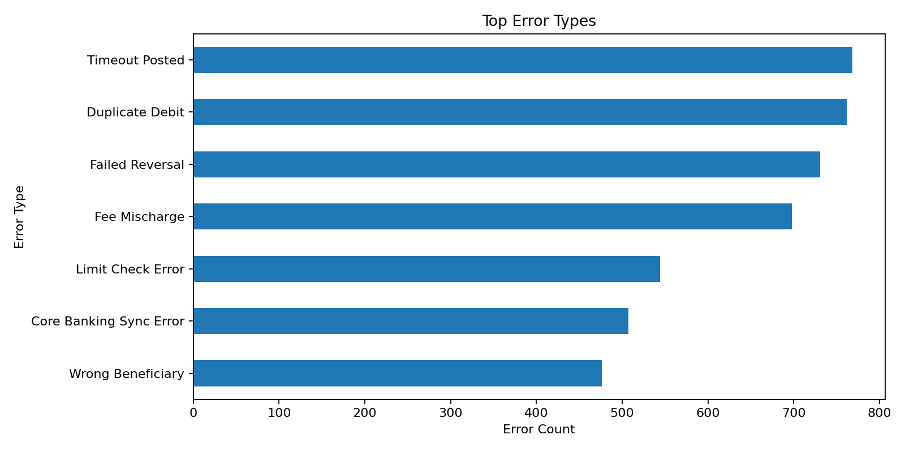

# Banking Transaction Error Detection Analytics

End-to-end banking operations analytics project focused on detecting, classifying, and reporting transaction posting errors — built with SQL, Python, and Power BI to support operations teams in quantifying refund exposure and resolving SLA breaches.

**Stack:** SQL · Python · scikit-learn · Power BI  
**Domain:** Banking Operations · Operational Risk

---

## Business Problem

Banks process thousands of transactions daily across channels including Mobile, Internet Banking, ATM, POS, Branch, and API. Some transactions fail, post incorrectly, duplicate, or reverse late — creating customer refund liability and regulatory risk.

This project helps operations teams answer:
- Which channels and error types carry the highest financial risk?
- What is the total refund exposure from unresolved cases?
- Where are SLA breaches concentrated and why?
- Which root causes should be prioritised for resolution?

---

## Dataset

| File | Description | Rows |
|---|---|---|
| `banking_transactions_raw.csv` | Raw transaction data with duplicates | 75,220 |
| `customers.csv` | Customer profiles | 8,000 |
| `accounts.csv` | Account dimension | 10,000 |
| `branches.csv` | Branch and region dimension | 80 |
| `banking_error_detection_model.csv` | Cleaned and enriched analytical dataset | 75,000 |

Data type: Synthetic, designed to simulate realistic banking operations patterns.

---

## Key KPIs

| Metric | Value |
|---|---|
| Total Transactions | 75,000 |
| Total Error Cases | 4,861 |
| Error Rate | 6.48% |
| Total Refund Exposure | MYR 842,406 |
| Average Resolution Time | 22.59 hours |
| SLA Breach Rate | 35.96% |

---

## Project Structure

```
├── data/
│   ├── raw/                              # Source CSVs (transactions, customers, accounts, branches)
│   └── processed/                        # Cleaned analytical dataset and KPI summary
├── notebooks/
│   └── banking_error_analysis.ipynb      # EDA, cleaning, feature engineering, model
├── sql/
│   ├── 01_create_tables.sql              # Schema and indexing
│   ├── 02_data_cleaning.sql              # Duplicate removal, standardisation
│   └── 03_analysis_queries.sql           # KPI queries, root cause breakdown, SLA tracking
├── powerbi/
│   ├── Banking-error-exec-dashboard.png  # Dashboard screenshot
│   └── powerbi_dax_and_visual_guide.md  # DAX measures and build reference
└── README.md
```

---

## Tech Stack

| Tool | Purpose |
|---|---|
| SQL | Schema creation, data cleaning, reconciliation queries, KPI generation |
| Python (pandas, NumPy) | Data cleaning, EDA, feature engineering |
| scikit-learn | Random Forest model to score error likelihood |
| Power BI + DAX | Four-page operational dashboard |

---

## SQL Analysis

- Schema creation and table indexing across 4 relational tables
- Duplicate detection and removal (preserving legitimate repeat transactions)
- Root cause classification using CASE logic
- SLA breach tracking by severity level
- Refund exposure quantification by channel and error type
- Customer impact ranking by total error value

---

## Power BI Dashboard

Four dashboard pages built for different operational audiences:

| Page | Audience | Content |
|---|---|---|
| Executive Overview | Management | Error rate, refund exposure, trend, channel breakdown |
| Error Investigation | Analysts | Error type, root cause, channel risk ranking |
| Operational SLA | Operations Managers | SLA breach rate by severity, resolution time distribution |
| Customer & Segment Risk | Customer Support | Top affected customers, segment concentration |

[
[
[
[
---

## Key Insights

1. API and POS channels carry disproportionately high error rates due to external integration dependencies — failures tend to occur in patterns, not randomly.
2. Duplicate debit, failed reversal, and wrong beneficiary errors have the highest per-case financial impact.
3. SLA breach rate of 35.96% indicates systemic resolution capacity issues, not just individual case delays.
4. High-value error cases (above MYR 10,000) warrant a dedicated daily review queue separate from standard operations.

---

## Business Recommendations

- Assign dedicated SLA monitoring for Critical and High severity error cases with automated escalation triggers.
- Investigate API channel integration failures as a systemic root cause rather than handling errors individually.
- Build an automated refund exposure dashboard refreshed daily to support real-time operations decisions.
- Create a customer communication workflow for high-value error cases to reduce complaint escalations.

---

## Getting Started

```bash
pip install pandas numpy scikit-learn matplotlib seaborn jupyter

# Run SQL scripts in order
# 01_create_tables.sql → 02_data_cleaning.sql → 03_analysis_queries.sql

# Run notebook
jupyter notebook notebooks/banking_error_analysis.ipynb
```

---

## Author

**Revathy Shanmugaraj** · [github.com/Revashan](https://github.com/Revashan)
